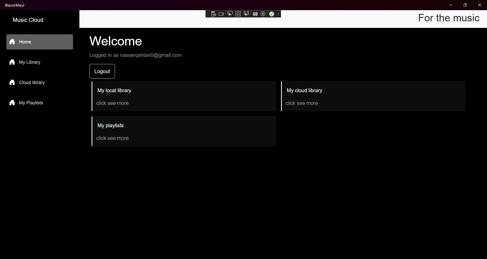
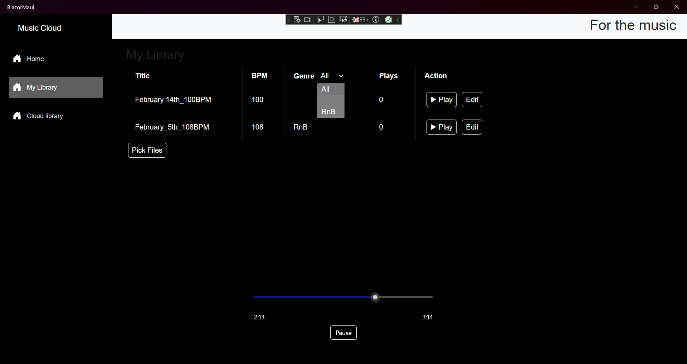
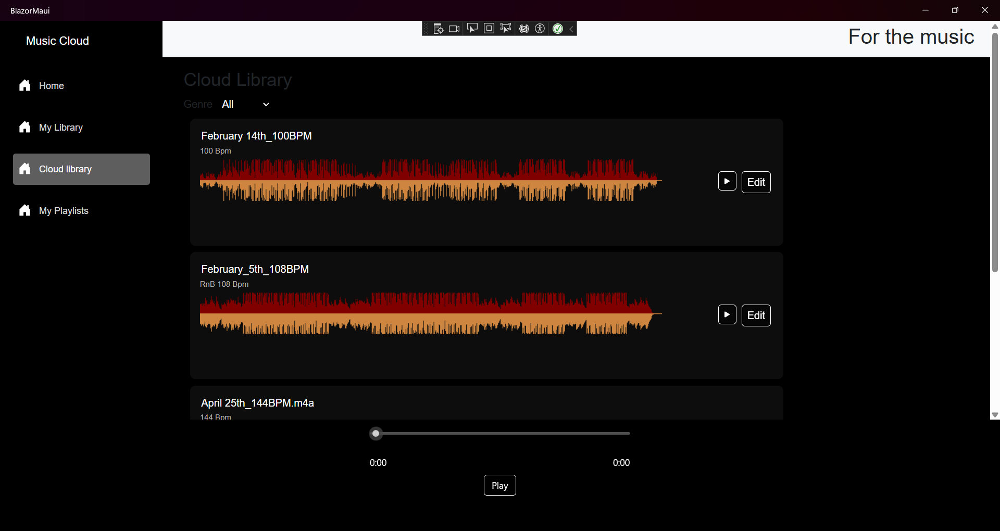
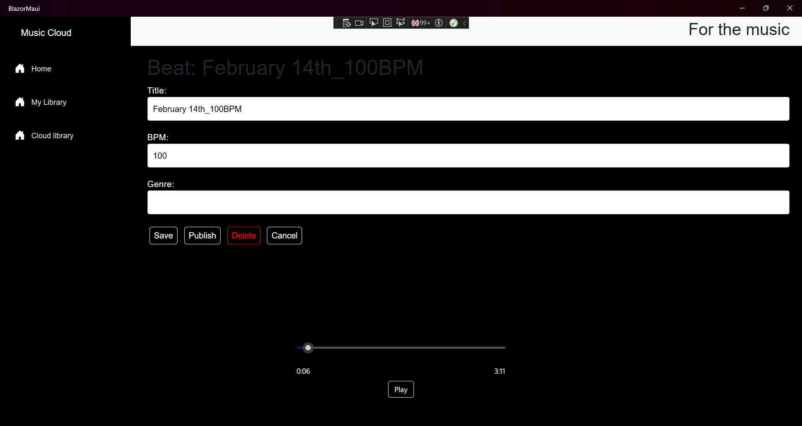
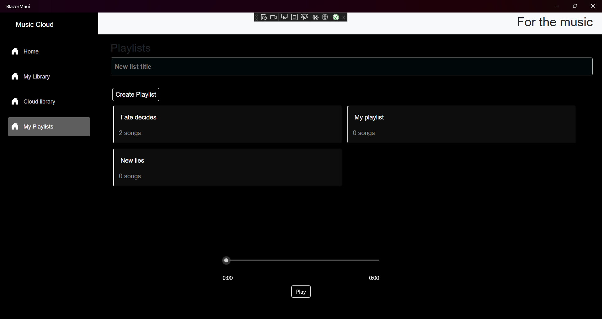
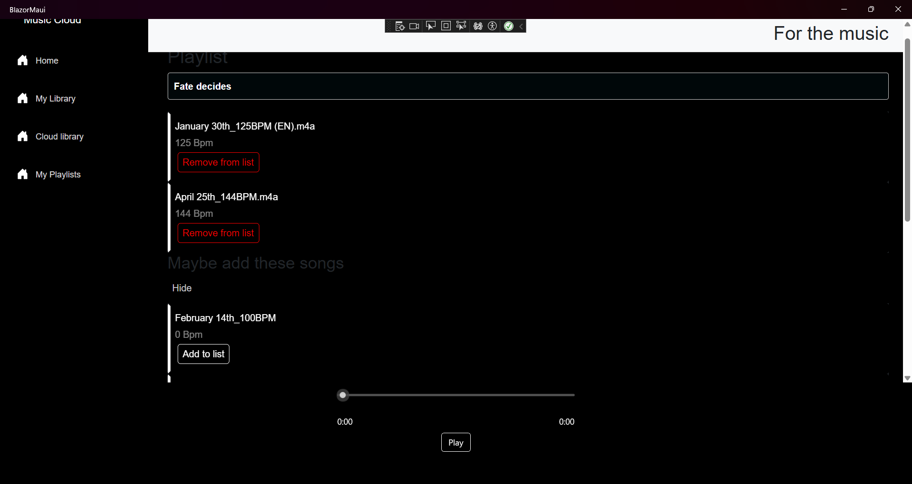
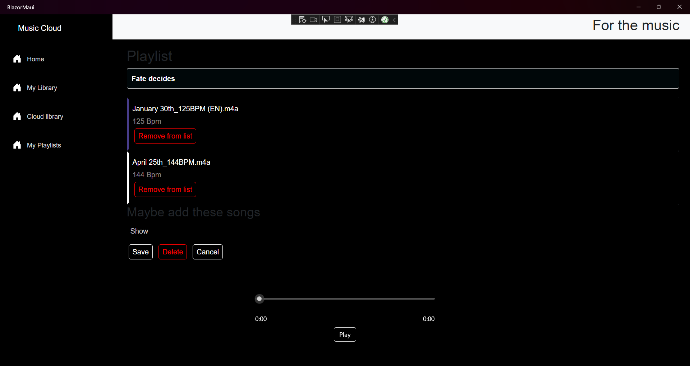

# MusicLab - Audio File Management for Producers (C# .NET MAUI Blazor Hybrid)

**MusicLab** is a desktop application built with C# .NET MAUI Blazor Hybrid, designed to help music producers organize, manage, and access their audio files on Windows.

**Currently Working:**

*   **Local & Cloud Storage:**  Store your audio files both locally on your Windows machine and on cloud storage.
*   **Metadata Editing:** Edit metadata for your audio files. Metadata is stored:
    *   Locally as JSON files.
    *   On the server database when published.
*   **Genre-Based Sorting:**  Organize and sort your audio files by genre for easy Browse within the application.
*   **Audio Streaming (Published Files):** Stream your published audio files directly from the server without needing to download them.

This project is a Windows desktop application and is under active development. Stay tuned for future updates and features!

**Backend**
*   **simplehttp:** was the initial backend written in a console app using HttpListner class, mostly for learning and understanding. Then ASP.NET was adopted then I switched to ASP.NET for scalability.
*   **HttpServer:** is the active backend for the application that handles authentication, authorization, jwt token generation and validation. File proccessing from the client and streaming back to the client through REST apis
